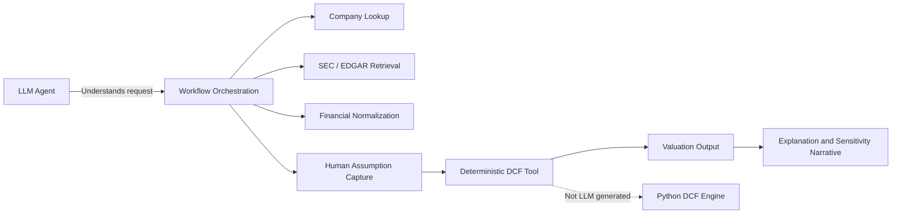
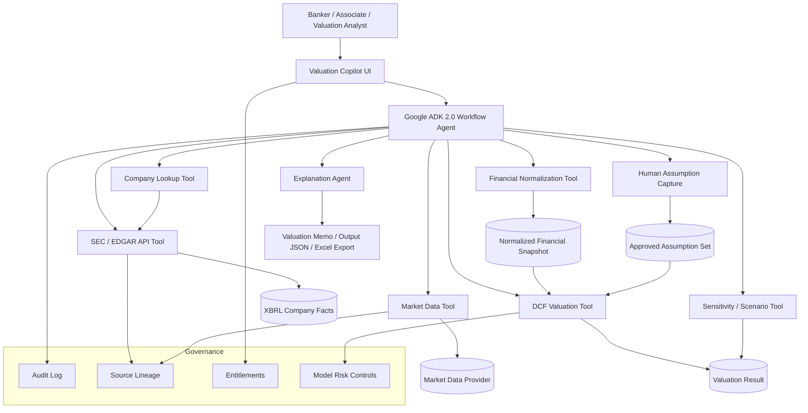
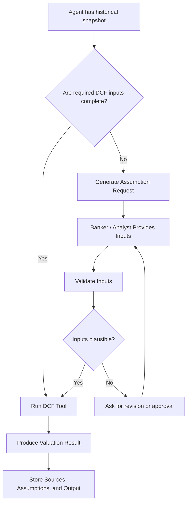
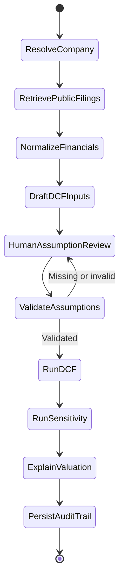
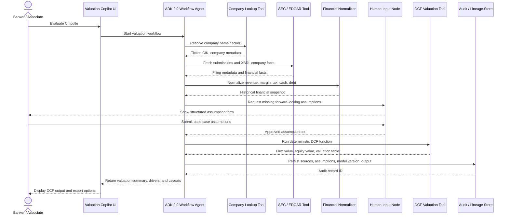
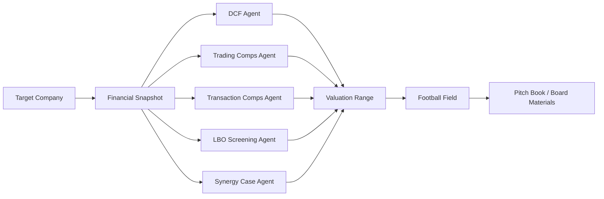

Below is a **copy-paste-ready Markdown article draft** with Mermaid diagrams included.

---

# From DCF Notebook to M&A Valuation Agent: Wrapping a Python Valuation Model with Google ADK 2.0

## Building an agentic valuation workflow for technical teams serving Investment Banking and M&A

Investment banking teams have always lived with a contradiction.

On one side, M&A valuation work is highly structured. Analysts build DCFs, trading comps, transaction comps, sensitivity tables, football fields, and board materials using well-understood methods.

On the other side, the process is still painfully manual.

A banker asks:

> “Can we run a base case DCF for this target?”

That simple request triggers a long chain of work:

* identify the company,
* pull the latest filings,
* normalize historical financials,
* spread revenue, EBIT, EBITDA, tax, cash, debt, and shares,
* decide which assumptions are factual and which are banker judgment,
* run the valuation,
* build sensitivities,
* explain the drivers,
* and document the assumptions for review.

The notebook I started with already solved one important part of the problem: it had a deterministic Python DCF engine.

The next step is not to ask an LLM to “do valuation.”

The better design is to let the LLM orchestrate the workflow while deterministic tools handle the math, data retrieval, validation, and audit trail.

In this article, I will walk through how to take a Python DCF notebook and wrap it as an agent tool using **Google ADK 2.0**, with SEC/EDGAR integration and human-in-the-loop assumption gathering. The target audience is technical teams supporting Investment Banking and M&A platforms: solution architects, data engineers, AI engineers, valuation technology teams, model risk teams, and deal-tech product owners.

> The goal is not to replace analysts.
> The goal is to make the valuation workflow repeatable, explainable, and easier to govern.

---

## Why this matters in an M&A environment

In M&A, valuation is not just a calculation. It is a work product.

A DCF can appear in:

* pitch books,
* fairness opinion support,
* board presentations,
* buy-side screening,
* sell-side positioning,
* strategic alternatives reviews,
* synergy cases,
* take-private analyses,
* carve-out models,
* and negotiation support.

For technical teams, that means the system must satisfy a different bar than a casual AI demo.

It must support:

| Requirement         | Why it matters in M&A                                                                                               |
| ------------------- | ------------------------------------------------------------------------------------------------------------------- |
| Repeatability       | The same assumptions should produce the same result every time.                                                     |
| Traceability        | Every value should be tied to a source, assumption, or transformation.                                              |
| Human judgment      | Growth, margin, WACC, terminal value, and synergy assumptions must be owned by bankers, not hallucinated by an LLM. |
| Entitlement control | Public data, licensed data, confidential data room content, and MNPI must be separated.                             |
| Reviewability       | MDs, valuation committees, legal, compliance, and model governance teams need a clear audit trail.                  |
| Explainability      | The output must explain what changed, why it changed, and which assumptions drive value.                            |

This is why the architecture should separate **agent orchestration** from **valuation computation**.

The LLM should not be the valuation model.

The LLM should be the workflow coordinator.

---

## The starting point: a Python DCF notebook

The attached notebook is a multi-phase DCF model.

At a high level, it contains:

* helper functions for convergence and projections,
* revenue projection logic,
* operating margin projection logic,
* tax rate projection logic,
* cost of capital projection logic,
* sales-to-capital and reinvestment logic,
* a main `valuator_multi_phase()` function,
* a `monte_carlo_valuator_multi_phase()` simulation wrapper,
* Plotly charting utilities,
* and a Chipotle valuation example.

The core function is the most important asset:

```python
valuator_multi_phase(...)
```

It takes assumptions such as:

* risk-free rate,
* equity risk premium,
* equity value,
* debt value,
* unlevered beta,
* terminal beta,
* cost of debt,
* effective and marginal tax rates,
* revenue base,
* multi-phase revenue growth,
* operating margin trajectory,
* sales-to-capital ratio,
* reinvestment assumptions,
* cash,
* debt,
* and current invested capital.

It returns a dictionary containing:

```python
{
    "valuation": df_valuation,
    "firm_value": firm_value,
    "equity_value": intrinsic_equity_present_value,
    "cash_and_non_operating_asset": cash_and_non_operating_asset,
    "debt_value": debt_value,
    "value_of_operating_assets": value_of_operating_assets
}
```

For a notebook, that is enough.

For an enterprise agent, it is not.

An agent needs:

* typed inputs,
* validation,
* missing-input detection,
* structured JSON output,
* source attribution,
* assumption lineage,
* exception handling,
* and workflow control.

So the first engineering task is to turn the notebook function into a tool.

---

## The key design principle

The central design principle is simple:

> Use deterministic code for valuation math.
> Use the agent for orchestration, data gathering, questioning, and explanation.

That gives us a clean separation of responsibilities.



This separation matters because DCF valuation has two very different categories of inputs.

Some are historical facts:

* revenue,
* operating income,
* tax expense,
* cash,
* debt,
* shares outstanding,
* filing dates,
* segment disclosures.

Others are judgment calls:

* future revenue growth,
* target operating margin,
* terminal growth,
* terminal return on capital,
* beta,
* equity risk premium,
* synergy capture,
* integration costs,
* control premium,
* and downside scenario assumptions.

A good M&A valuation agent should know the difference.

---

## Where Google ADK fits

Google ADK lets developers define agents with tools and custom Python functions. A Python function can be assigned to an agent’s `tools` list, and ADK automatically wraps it as a `FunctionTool`. The framework inspects the function signature, docstring, parameters, type hints, and defaults to generate the schema the model uses to call the tool. ([ADK][1])

That is exactly what we need for a DCF function.

Google ADK also supports enterprise-oriented agent development patterns including tool integration, multi-agent architectures, workflow orchestration, evaluation, and deployment options such as Cloud Run and GKE. ([Google Cloud Documentation][2])

For this use case, the interesting part is **ADK 2.0 graph workflows**.

The ADK 2.0 human-input documentation describes graph workflows that can pause execution and request human input through `RequestInput`. This is valuable for M&A valuation because some assumptions must be explicitly provided or approved by a human. ADK 2.0 is currently marked as Beta, and Google notes that it may introduce breaking changes and should not be used where backward compatibility is required. ([ADK][3])

For an article prototype, that is acceptable.

For bank production, treat ADK 2.0 as an evaluation candidate and put it behind your normal platform engineering, model risk, security, and change-management processes.

---

## Target architecture for an M&A valuation agent

Here is the target architecture.



The agent does not directly value the company.

It coordinates a controlled pipeline:

1. Resolve the target company.
2. Retrieve public filings.
3. Normalize historical facts.
4. Ask the banker for forward-looking assumptions.
5. Validate assumptions.
6. Run the deterministic DCF function.
7. Explain the result.
8. Store the sources, assumptions, and outputs.

---

## SEC/EDGAR as the public-company data layer

For public companies, SEC/EDGAR is a natural starting point.

The SEC provides JSON-based APIs through `data.sec.gov` for company submissions and XBRL financial statement data. The SEC documentation states that these APIs do not require authentication or API keys and include submissions history and XBRL data from forms such as 10-K, 10-Q, 8-K, 20-F, 40-F, and others. ([SEC][4])

Useful endpoints include:

```text
https://www.sec.gov/files/company_tickers.json
https://data.sec.gov/submissions/CIK##########.json
https://data.sec.gov/api/xbrl/companyfacts/CIK##########.json
https://data.sec.gov/api/xbrl/companyconcept/CIK##########/us-gaap/<TAG>.json
```

The submissions endpoint uses a 10-digit CIK with leading zeros and returns company metadata, former names, exchanges, tickers, and recent filing history. ([SEC][4])

For technical teams, there is one operational caveat: respect SEC fair-access policies. The SEC developer guidance says current guidelines limit users to no more than 10 requests per second, regardless of the number of machines used. It also warns against excessive or unclassified automated access. ([SEC][5])

In other words, production architecture needs:

* user-agent headers,
* rate limiting,
* retries with backoff,
* caching,
* request logging,
* and source traceability.

---

## Public company vs. private target data

SEC/EDGAR is useful, but M&A teams frequently work with private companies or confidential targets.

So the architecture should support multiple source types.

| Source type         | Example                                         | Agent role                                    |
| ------------------- | ----------------------------------------------- | --------------------------------------------- |
| Public filings      | SEC 10-K, 10-Q, 8-K                             | Retrieve and normalize historical public data |
| Market data         | Price, market cap, beta, yields                 | Pull licensed or approved market metrics      |
| Banker assumptions  | Growth, margin, synergies, terminal assumptions | Ask, validate, and record                     |
| Data room documents | CIM, QoE, management case, customer metrics     | Retrieve only if entitled                     |
| Internal models     | Existing Excel operating model                  | Extract assumptions and reconcile             |
| Comps database      | Trading comps and transaction comps             | Benchmark DCF output                          |

For public companies, the agent can start with EDGAR.

For private targets, the agent may need to connect to:

* a virtual data room,
* internal SharePoint or document repository,
* licensed market data APIs,
* uploaded Excel models,
* CRM/deal systems,
* or internal data products.

The same pattern still applies.

The agent orchestrates.

The tools retrieve, normalize, calculate, and log.

---

## Step 1: wrap the DCF notebook function as a tool

The notebook function should not be exposed directly.

Instead, create a wrapper that:

* accepts a dictionary of DCF assumptions,
* checks for missing inputs,
* validates obvious inconsistencies,
* calls `valuator_multi_phase()`,
* and returns a JSON-friendly result.

Example:

```python
# valuation/dcf_tool.py

from typing import Any, Dict

from valuation.dcf_model import valuator_multi_phase


REQUIRED_DCF_KEYS = [
    "risk_free_rate",
    "ERP",
    "equity_value",
    "debt_value",
    "unlevered_beta",
    "terminal_unlevered_beta",
    "year_beta_begins_to_converge_to_terminal_beta",
    "current_pretax_cost_of_debt",
    "terminal_pretax_cost_of_debt",
    "year_cost_of_debt_begins_to_converge_to_terminal_cost_of_debt",
    "current_effective_tax_rate",
    "marginal_tax_rate",
    "year_effective_tax_rate_begin_to_converge_marginal_tax_rate",
    "revenue_base",
    "revenue_growth_rate_cycle1_begin",
    "revenue_growth_rate_cycle1_end",
    "revenue_growth_rate_cycle2_begin",
    "revenue_growth_rate_cycle2_end",
    "revenue_growth_rate_cycle3_begin",
    "revenue_growth_rate_cycle3_end",
    "revenue_convergance_periods_cycle1",
    "revenue_convergance_periods_cycle2",
    "revenue_convergance_periods_cycle3",
    "length_of_cylcle1",
    "length_of_cylcle2",
    "length_of_cylcle3",
    "current_sales_to_capital_ratio",
    "terminal_sales_to_capital_ratio",
    "year_sales_to_capital_begins_to_converge_to_terminal_sales_to_capital",
    "current_operating_margin",
    "terminal_operating_margin",
    "year_operating_margin_begins_to_converge_to_terminal_operating_margin",
]


def run_dcf_valuation(params: Dict[str, Any]) -> Dict[str, Any]:
    """
    Runs a multi-phase discounted cash flow valuation.

    Args:
        params:
            Dictionary of DCF assumptions. Percentage values should be
            expressed as decimals. For example, 4% should be 0.04.

    Returns:
        A JSON-friendly dictionary containing firm value, intrinsic equity
        value, operating asset value, debt, cash, and the projected valuation
        table.

    Governance:
        This function should only be called after historical facts and
        forward-looking assumptions have been collected, validated, and logged.
    """
    missing = [key for key in REQUIRED_DCF_KEYS if key not in params]

    if missing:
        return {
            "status": "missing_inputs",
            "missing_inputs": missing,
            "message": "DCF cannot run until all required inputs are provided.",
        }

    terminal_growth = params["revenue_growth_rate_cycle3_end"]
    risk_free_rate = params["risk_free_rate"]

    if terminal_growth > risk_free_rate:
        return {
            "status": "invalid_inputs",
            "message": (
                "Terminal growth is higher than the risk-free rate. "
                "Please revise or explicitly approve this assumption."
            ),
            "terminal_growth_rate": terminal_growth,
            "risk_free_rate": risk_free_rate,
        }

    result = valuator_multi_phase(**params)

    valuation_table = result["valuation"].reset_index().to_dict(orient="records")

    return {
        "status": "success",
        "firm_value": float(result["firm_value"]),
        "intrinsic_equity_value": float(result["equity_value"]),
        "value_of_operating_assets": float(result["value_of_operating_assets"]),
        "cash_and_non_operating_asset": float(result["cash_and_non_operating_asset"]),
        "debt_value": float(result["debt_value"]),
        "valuation_table": valuation_table,
    }
```

This wrapper turns a research notebook into a controlled tool.

In an ADK agent, the function can be made available like this:

```python
from google.adk.agents import Agent

from valuation.dcf_tool import run_dcf_valuation


dcf_agent = Agent(
    name="dcf_valuation_agent",
    model="gemini-2.0-flash",
    instruction="""
You are a valuation workflow assistant for M&A teams.

Do not invent forward-looking assumptions.
If required DCF assumptions are missing, ask the user.
Only call run_dcf_valuation when the assumption set is complete.
Always separate SEC-derived facts, market data, and user-provided assumptions.
""",
    tools=[run_dcf_valuation],
)
```

This is the simplest pattern.

For a bank-grade workflow, I would go further and use an explicit ADK 2.0 graph workflow.

---

## Step 2: build SEC tools

The SEC tool layer should do three jobs:

1. Resolve company name or ticker to CIK.
2. Retrieve company filings and XBRL facts.
3. Return structured data with source metadata.

Example:

```python
# data/sec_tools.py

from typing import Any, Dict
import requests


SEC_HEADERS = {
    "User-Agent": "Your Firm Name valuation-platform@example.com",
    "Accept-Encoding": "gzip, deflate",
}


def _sec_get_json(url: str) -> Dict[str, Any]:
    response = requests.get(url, headers=SEC_HEADERS, timeout=30)
    response.raise_for_status()
    return response.json()


def _format_cik(cik: int | str) -> str:
    return f"CIK{int(cik):010d}"


def lookup_company(query: str) -> Dict[str, Any]:
    """
    Resolves a ticker or company name to SEC company metadata.

    Args:
        query:
            Company name or ticker. Example: "CMG" or "Chipotle".

    Returns:
        Matching SEC company records with ticker, title, and CIK.
    """
    url = "https://www.sec.gov/files/company_tickers.json"
    data = _sec_get_json(url)

    q = query.strip().upper()
    matches = []

    for item in data.values():
        ticker = item["ticker"].upper()
        title = item["title"].upper()

        if q == ticker or q in title:
            matches.append(
                {
                    "ticker": item["ticker"],
                    "title": item["title"],
                    "cik": item["cik_str"],
                    "cik_padded": _format_cik(item["cik_str"]),
                }
            )

    if not matches:
        return {
            "status": "not_found",
            "query": query,
            "message": "No SEC company match found.",
        }

    return {
        "status": "success",
        "query": query,
        "best_match": matches[0],
        "matches": matches[:10],
    }


def fetch_company_submissions(cik: int | str) -> Dict[str, Any]:
    """
    Fetches recent SEC filing metadata for a company.
    """
    cik_padded = _format_cik(cik)
    url = f"https://data.sec.gov/submissions/{cik_padded}.json"
    return _sec_get_json(url)


def fetch_company_facts(cik: int | str) -> Dict[str, Any]:
    """
    Fetches SEC XBRL company facts for a company.
    """
    cik_padded = _format_cik(cik)
    url = f"https://data.sec.gov/api/xbrl/companyfacts/{cik_padded}.json"
    return _sec_get_json(url)
```

This is not enough for production, but it is enough to demonstrate the architecture.

A production implementation should add:

* retry/backoff,
* caching by CIK and filing date,
* SEC rate limiting,
* source URL capture,
* filing accession tracking,
* taxonomy version tracking,
* and data quality flags.

---

## Step 3: normalize XBRL facts into a DCF starting point

SEC XBRL data is powerful, but it is not a ready-made DCF input sheet.

Different companies may use different tags for similar concepts. Some use standard US-GAAP tags. Others use extensions. Some values are annual. Others are quarterly. Some are point-in-time balance sheet items. Others are duration-based income statement items.

So we need a normalization layer.

Example:

```python
# data/sec_normalizer.py

from typing import Any, Dict, Iterable, Optional


def _latest_annual_usd_fact(
    company_facts: Dict[str, Any],
    tag_candidates: Iterable[str],
) -> Optional[float]:
    us_gaap = company_facts.get("facts", {}).get("us-gaap", {})

    for tag in tag_candidates:
        concept = us_gaap.get(tag)
        if not concept:
            continue

        usd_facts = concept.get("units", {}).get("USD", [])
        annual = [
            item for item in usd_facts
            if item.get("form") == "10-K" and item.get("fp") == "FY"
        ]

        if not annual:
            continue

        annual = sorted(
            annual,
            key=lambda x: (x.get("fy", 0), x.get("filed", "")),
            reverse=True,
        )

        return float(annual[0]["val"])

    return None


def build_financial_snapshot(company_facts: Dict[str, Any]) -> Dict[str, Any]:
    """
    Converts SEC company facts into a compact DCF starting point.

    This function extracts historical facts only.
    It does not generate future assumptions.
    """
    revenue = _latest_annual_usd_fact(
        company_facts,
        [
            "RevenueFromContractWithCustomerExcludingAssessedTax",
            "Revenues",
            "SalesRevenueNet",
        ],
    )

    operating_income = _latest_annual_usd_fact(
        company_facts,
        ["OperatingIncomeLoss"],
    )

    tax_expense = _latest_annual_usd_fact(
        company_facts,
        ["IncomeTaxExpenseBenefit"],
    )

    pretax_income = _latest_annual_usd_fact(
        company_facts,
        [
            "IncomeLossFromContinuingOperationsBeforeIncomeTaxesExtraordinaryItemsNoncontrollingInterest",
            "IncomeLossFromContinuingOperationsBeforeIncomeTaxes",
        ],
    )

    cash = _latest_annual_usd_fact(
        company_facts,
        [
            "CashAndCashEquivalentsAtCarryingValue",
            "CashCashEquivalentsRestrictedCashAndRestrictedCashEquivalents",
        ],
    )

    debt = _latest_annual_usd_fact(
        company_facts,
        [
            "LongTermDebtAndFinanceLeaseObligations",
            "LongTermDebtNoncurrent",
            "LongTermDebt",
        ],
    )

    operating_margin = None
    if revenue and operating_income is not None:
        operating_margin = operating_income / revenue

    effective_tax_rate = None
    if pretax_income and pretax_income > 0 and tax_expense is not None:
        effective_tax_rate = tax_expense / pretax_income

    return {
        "status": "success",
        "revenue_base": revenue,
        "operating_income": operating_income,
        "current_operating_margin": operating_margin,
        "current_effective_tax_rate": effective_tax_rate,
        "cash_and_non_operating_asset": cash,
        "debt_value_book": debt,
        "notes": [
            "These are historical starting points from public filings.",
            "Future growth, target margin, WACC, reinvestment, and terminal assumptions require human judgment.",
        ],
    }
```

This function is intentionally conservative.

It does not pretend to know the future.

That is the right behavior in M&A.

---

## Step 4: ask the human for forward-looking assumptions

This is where human-in-the-loop design matters.

An agent can fetch historical revenue.

It should not silently decide that a company will grow at 12% for five years.

In M&A, assumptions are part of the deal narrative. They may reflect:

* management projections,
* banker case,
* buyer base case,
* sponsor downside case,
* synergy case,
* standalone case,
* or street consensus.

The agent should ask for those assumptions and record who provided them.



With ADK 2.0 graph workflows, this can be represented as an explicit human input node.

```python
from pydantic import BaseModel
from google.adk.events import RequestInput


class DCFUserAssumptions(BaseModel):
    risk_free_rate: float
    ERP: float

    unlevered_beta: float
    terminal_unlevered_beta: float

    current_pretax_cost_of_debt: float
    terminal_pretax_cost_of_debt: float

    marginal_tax_rate: float

    revenue_growth_rate_cycle1_begin: float
    revenue_growth_rate_cycle1_end: float
    length_of_cylcle1: int

    revenue_growth_rate_cycle2_begin: float
    revenue_growth_rate_cycle2_end: float
    length_of_cylcle2: int

    revenue_growth_rate_cycle3_begin: float
    revenue_growth_rate_cycle3_end: float
    length_of_cylcle3: int

    current_sales_to_capital_ratio: float
    terminal_sales_to_capital_ratio: float

    terminal_operating_margin: float
    additional_return_on_cost_of_capital_in_perpetuity: float


def request_dcf_assumptions(snapshot: dict):
    message = f"""
I found the following historical starting point:

Company: {snapshot.get("company_name")}
Ticker: {snapshot.get("ticker")}
Revenue base: {snapshot.get("revenue_base")}
Current operating margin: {snapshot.get("current_operating_margin")}
Current effective tax rate: {snapshot.get("current_effective_tax_rate")}
Cash: {snapshot.get("cash_and_non_operating_asset")}
Book debt: {snapshot.get("debt_value_book")}

I still need forward-looking valuation assumptions.

Please provide:
- risk-free rate
- equity risk premium
- unlevered beta now and terminal beta
- pretax cost of debt now and terminal cost of debt
- marginal tax rate
- three-phase revenue growth assumptions
- length of each forecast phase
- sales-to-capital ratio now and terminal
- terminal operating margin
- long-run excess return on capital, if any

Use decimals. Example: 4% should be 0.04.
"""

    yield RequestInput(
        message=message,
        payload=snapshot,
        response_schema=DCFUserAssumptions,
    )
```

For production, I would not rely on free-text responses for this step.

Use a structured UI:

* numeric fields,
* dropdowns for scenario type,
* validation ranges,
* approval workflow,
* assumption comments,
* and lineage tags.

Example:

| Input                    | Source                      | Owner        | Required control             |
| ------------------------ | --------------------------- | ------------ | ---------------------------- |
| Historical revenue       | SEC / data room             | System       | Source reference             |
| Current operating margin | SEC / normalized financials | System       | Data quality flag            |
| Forecast growth          | Banker / management case    | Human        | Required approval            |
| Terminal growth          | Banker / valuation policy   | Human        | Range validation             |
| WACC                     | Market data + assumption    | Human/system | Methodology disclosure       |
| Synergies                | Deal team                   | Human        | Scenario label               |
| Control premium          | Banker                      | Human        | Separate from standalone DCF |

---

## Step 5: define the workflow graph

For M&A, I prefer an explicit workflow graph over a purely autonomous agent.

Valuation is sequential. The system should not jump ahead.

A clean workflow looks like this:



A simplified ADK 2.0-style workflow might look like this:

```python
from google.adk import Workflow

from data.sec_tools import lookup_company, fetch_company_facts
from data.sec_normalizer import build_financial_snapshot
from valuation.dcf_tool import run_dcf_valuation


def resolve_company_node(user_request: dict) -> dict:
    result = lookup_company(user_request["company"])
    return result["best_match"]


def fetch_company_facts_node(company: dict) -> dict:
    facts = fetch_company_facts(company["cik"])
    return {
        "company": company,
        "company_facts": facts,
    }


def normalize_financials_node(node_input: dict) -> dict:
    snapshot = build_financial_snapshot(node_input["company_facts"])

    snapshot["company_name"] = node_input["company"]["title"]
    snapshot["ticker"] = node_input["company"]["ticker"]
    snapshot["cik"] = node_input["company"]["cik"]

    return snapshot


def merge_inputs_node(node_input: dict) -> dict:
    snapshot = node_input["snapshot"]
    assumptions = node_input["assumptions"]

    params = {}

    # Historical facts
    params["revenue_base"] = snapshot["revenue_base"]
    params["current_operating_margin"] = snapshot["current_operating_margin"]
    params["current_effective_tax_rate"] = snapshot["current_effective_tax_rate"]
    params["cash_and_non_operating_asset"] = snapshot["cash_and_non_operating_asset"]
    params["debt_value"] = snapshot["debt_value_book"]

    # Human assumptions
    params.update(assumptions)

    # Convergence defaults
    params["year_beta_begins_to_converge_to_terminal_beta"] = 1
    params["year_cost_of_debt_begins_to_converge_to_terminal_cost_of_debt"] = 3
    params["year_effective_tax_rate_begin_to_converge_marginal_tax_rate"] = 1
    params["revenue_convergance_periods_cycle1"] = 1
    params["revenue_convergance_periods_cycle2"] = 1
    params["revenue_convergance_periods_cycle3"] = 1
    params["year_sales_to_capital_begins_to_converge_to_terminal_sales_to_capital"] = 1
    params["year_operating_margin_begins_to_converge_to_terminal_operating_margin"] = 1

    return params


root_agent = Workflow(
    name="mna_dcf_valuation_workflow",
    edges=[
        (
            "START",
            resolve_company_node,
            fetch_company_facts_node,
            normalize_financials_node,
            request_dcf_assumptions,
            merge_inputs_node,
            run_dcf_valuation,
        )
    ],
)
```

This is intentionally simplified.

A real banking workflow would add:

* entitlement checks before retrieval,
* source classification,
* data room permission validation,
* input approval routing,
* model version pinning,
* output retention policy,
* and compliance logging.

---

## Interaction diagram

Here is the end-to-end interaction pattern.



This is the workflow technical teams should build toward.

Not a chatbot that gives a valuation.

A governed valuation pipeline with conversational interaction.

---

## Example user experience

The interaction could look like this.

```text
User:
Evaluate Chipotle.

Agent:
I found Chipotle Mexican Grill, Inc. with ticker CMG and SEC CIK #######.

I pulled the latest available SEC XBRL facts and created a historical starting point:

Revenue base: $...
Current operating margin: ...
Current effective tax rate: ...
Cash and non-operating assets: $...
Book debt: $...

I still need forward-looking assumptions before I can run the DCF.

Please provide:
1. Revenue growth assumptions for phase 1, phase 2, and phase 3
2. Length of each forecast phase
3. Terminal operating margin
4. Risk-free rate
5. Equity risk premium
6. Unlevered beta and terminal beta
7. Sales-to-capital ratio now and terminal
8. Terminal growth / mature phase growth
9. Excess return on capital in perpetuity, if any
```

The banker responds:

```text
Use a base case:
risk-free rate 4.0%
ERP 4.8%
unlevered beta 0.90
terminal beta 1.00
phase 1 growth 12% to 10% over 5 years
phase 2 growth 9% to 6% over 5 years
phase 3 growth 5% to 3% over 5 years
terminal operating margin 18%
sales-to-capital ratio 1.7 now, 1.3 terminal
marginal tax rate 25%
excess return on capital in perpetuity 1.5%
```

The agent validates the assumptions, calls the DCF tool, and responds:

```text
I ran the DCF using the base case assumptions.

Intrinsic equity value: $...
Firm value: $...
Value of operating assets: $...
Cash and non-operating assets: $...
Debt: $...

The largest drivers were:
1. Terminal operating margin
2. Mature phase growth
3. Sales-to-capital ratio
4. Cost of capital

This output is a model result, not investment advice.
The assumptions came from the user-provided base case and the historical starting point came from SEC filings.
```

For M&A teams, the next step would be to export the result into:

* Excel,
* PowerPoint,
* valuation committee memo,
* model audit file,
* or a deal workspace.

---

## Why the LLM should not invent assumptions

One of the most common mistakes in agentic finance demos is asking the model:

> “Value this company.”

The model then fabricates a plausible-looking valuation.

That is dangerous.

A DCF is not valuable because the math is difficult. The math is manageable.

The difficulty is connecting business judgment to assumptions:

* How long can the company grow above the market?
* Does the target deserve a margin premium?
* Are synergies real or aspirational?
* Will reinvestment intensity fall over time?
* Is terminal growth consistent with macro assumptions?
* Should the company converge toward industry returns?
* Is the capital structure changing post-transaction?

These are not just numbers.

They are deal assumptions.

In M&A, those assumptions need owners.

That is why the agent should ask for missing inputs instead of manufacturing them.

---

## Adding Monte Carlo simulation

The original notebook also includes a Monte Carlo wrapper.

That is useful for M&A because investment banking teams rarely care about a single-point estimate alone. They care about ranges.

A Monte Carlo version of the agent could allow bankers to provide distributions instead of single assumptions.

For example:

| Variable         | Base case | Distribution                         |
| ---------------- | --------: | ------------------------------------ |
| Terminal margin  |     18.0% | Normal, mean 18%, stdev 1.5%         |
| Terminal growth  |      3.0% | Triangular, low 2%, mode 3%, high 4% |
| Sales-to-capital |      1.3x | Normal, mean 1.3x, stdev 0.2x        |
| ERP              |      4.8% | Fixed or scenario-based              |
| Revenue CAGR     |      8.0% | Scenario distribution                |

The agent could then produce:

* valuation percentile range,
* downside/base/upside cases,
* probability of exceeding current market value,
* key value drivers,
* and sensitivity charts.

However, this should still be controlled.

The user should approve the distributions.

The model should not invent them.

---

## Suggested project structure

A clean implementation could look like this:

```text
mna-valuation-agent/
  app/
    agent.py
    workflow.py
    prompts/
      valuation_agent.md
      assumption_request.md
      valuation_explanation.md

  valuation/
    dcf_model.py
    dcf_tool.py
    monte_carlo_tool.py
    sensitivity_tool.py

  data/
    sec_tools.py
    sec_normalizer.py
    market_data_tools.py
    private_company_tools.py
    source_lineage.py

  governance/
    entitlements.py
    audit_log.py
    model_registry.py
    validation_rules.py

  tests/
    test_dcf_tool.py
    test_sec_normalizer.py
    test_assumption_validation.py
    test_workflow_paths.py

  notebooks/
    original_dcf_notebook.ipynb

  pyproject.toml
  README.md
```

The important move is to isolate the notebook logic into a reusable Python package.

The notebook can remain useful for research and demonstration, but production systems need modules, tests, versioning, and interfaces.

---

## Production controls for banking environments

Technical teams serving M&A should treat this as a controlled workflow, not a productivity toy.

Here are the core controls I would add before production.

### 1. Entitlement and data classification

The agent should know whether it is using:

* public data,
* licensed market data,
* internal research,
* confidential client data,
* data room content,
* or MNPI.

Different data classes should have different permissions, storage rules, and output restrictions.

### 2. Source lineage

Every historical number should carry metadata:

```json
{
  "value": 123456789,
  "metric": "Revenue",
  "source": "SEC XBRL",
  "form": "10-K",
  "filing_date": "YYYY-MM-DD",
  "accession_number": "...",
  "xbrl_tag": "RevenueFromContractWithCustomerExcludingAssessedTax"
}
```

This is critical for review.

### 3. Assumption ownership

Every forward-looking assumption should carry:

```json
{
  "assumption": "terminal_operating_margin",
  "value": 0.18,
  "scenario": "base_case",
  "provided_by": "analyst@example.com",
  "approved_by": "vp@example.com",
  "timestamp": "2026-05-11T10:30:00Z",
  "comment": "Based on management case and peer margin benchmarking."
}
```

In M&A, assumption ownership is not optional.

### 4. Model versioning

The output should record:

* DCF model version,
* Python package version,
* notebook lineage,
* valuation date,
* scenario name,
* run ID,
* and input hash.

That makes old valuations reproducible.

### 5. Prompt and tool logging

The platform should log:

* user request,
* tool calls,
* tool outputs,
* assumptions requested,
* assumptions provided,
* validation warnings,
* and final result.

This is especially important for regulated environments.

### 6. Guardrails

The agent should refuse or escalate when:

* required assumptions are missing,
* terminal growth exceeds a policy threshold,
* source data is stale,
* filings cannot be reconciled,
* user lacks entitlement,
* confidential data would be exposed,
* or the user asks for unsupported investment advice.

---

## Recommended agent instruction

The system instruction for the valuation agent should be explicit.

```text
You are an M&A valuation workflow assistant.

Your job is to coordinate valuation workflows, not to independently make
investment recommendations.

Always separate:
1. Historical facts from filings or approved data sources
2. Market data from approved providers
3. User-provided assumptions
4. Model-generated outputs

Never invent forward-looking assumptions unless the user explicitly asks for
an illustrative scenario. If you create an illustrative scenario, label it
clearly as illustrative and not banker-approved.

Before calling the DCF valuation tool:
- check that all required inputs are available
- validate percentage values
- check terminal growth against policy limits
- check that the valuation date is specified
- confirm the scenario name
- capture assumption provenance

After running the model:
- explain the result
- show the key assumptions
- identify the largest value drivers
- disclose data sources
- state limitations
- do not provide buy/sell/hold recommendations
```

This instruction is simple, but it changes the behavior of the system.

It tells the agent to behave like a controlled workflow assistant, not a market commentator.

---

## Extending the agent for real M&A workflows

Once the basic DCF agent works, technical teams can extend it into a broader M&A valuation platform.



This is where the architecture becomes powerful.

The same source lineage, entitlement controls, and human-in-the-loop assumption pattern can support:

* DCF,
* public comps,
* precedent transactions,
* accretion/dilution,
* LBO screening,
* sum-of-the-parts,
* synergy modeling,
* and fairness opinion support.

The DCF tool is just the first tool.

The broader opportunity is an agentic valuation workbench.

---

## What not to automate

There are parts of M&A valuation that should remain human-led.

Do not fully automate:

* final valuation conclusions,
* fairness opinion judgments,
* board recommendation language,
* synergy credibility assessment,
* buyer intent,
* negotiation strategy,
* or legal/compliance sign-off.

Agents can accelerate analysis.

They should not own judgment.

The right model is:

```text
Machine prepares.
Human decides.
System records.
```

---

## Conclusion

The most important lesson from turning a DCF notebook into an agent is this:

> The LLM should not be the valuation model.

The valuation model should be deterministic, tested, and versioned.

The LLM should orchestrate:

* company lookup,
* filing retrieval,
* financial normalization,
* assumption collection,
* validation,
* tool execution,
* explanation,
* and audit logging.

For technical teams supporting Investment Banking and M&A, this distinction is critical.

A chatbot that “values companies” is interesting.

A governed agentic valuation workflow is useful.

The future of M&A technology is not replacing bankers with agents. It is giving deal teams better infrastructure: tools that reduce manual effort, preserve judgment, improve traceability, and make valuation work easier to review.

That is the real opportunity.

---

## References

* Google ADK Function Tools documentation: custom Python functions can be used as agent tools, and ADK inspects function signatures, docstrings, type hints, and defaults to generate the tool schema. ([ADK][1])
* Google ADK 2.0 Human Input documentation: graph workflows can use `RequestInput` for human-in-the-loop data capture; ADK 2.0 is currently marked Beta. ([ADK][3])
* SEC EDGAR API documentation: `data.sec.gov` provides JSON APIs for submissions and XBRL company facts without API keys. ([SEC][4])
* SEC Developer Resources: fair-access guidance currently limits users to no more than 10 requests per second. ([SEC][5])
* Google Cloud ADK overview: ADK supports custom code, orchestration, evaluation, multi-agent architectures, and enterprise deployment patterns. ([Google Cloud Documentation][2])

[1]: https://adk.dev/tools-custom/function-tools/ "Overview - Agent Development Kit (ADK)"
[2]: https://docs.cloud.google.com/gemini-enterprise-agent-platform/build/adk "Agent Development Kit  |  Gemini Enterprise Agent Platform  |  Google Cloud Documentation"
[3]: https://adk.dev/workflows/human-input/ "Human input - Agent Development Kit (ADK)"
[4]: https://www.sec.gov/search-filings/edgar-application-programming-interfaces "SEC.gov | EDGAR Application Programming Interfaces (APIs)"
[5]: https://www.sec.gov/about/developer-resources "SEC.gov | Developer Resources"
