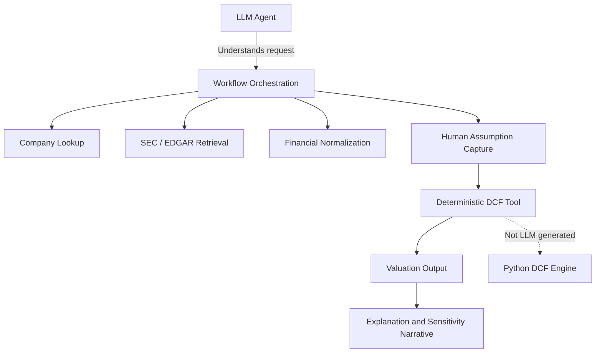
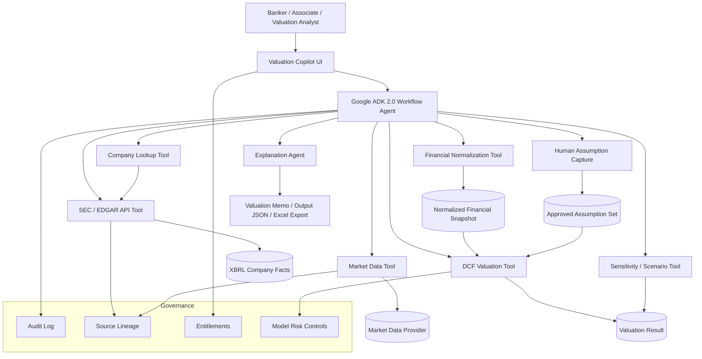
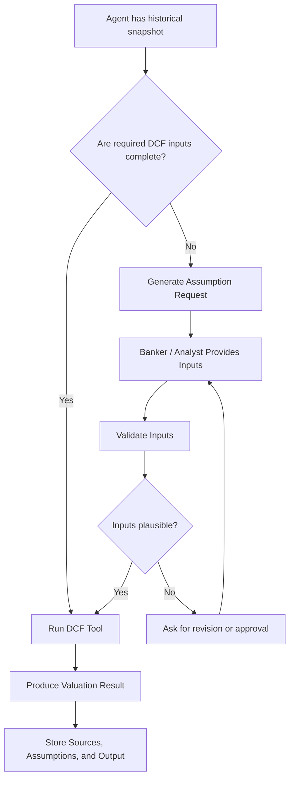
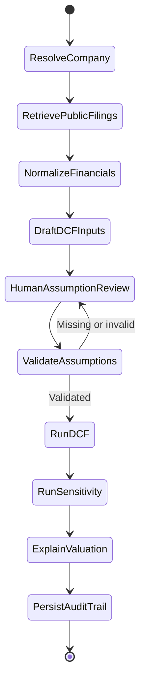
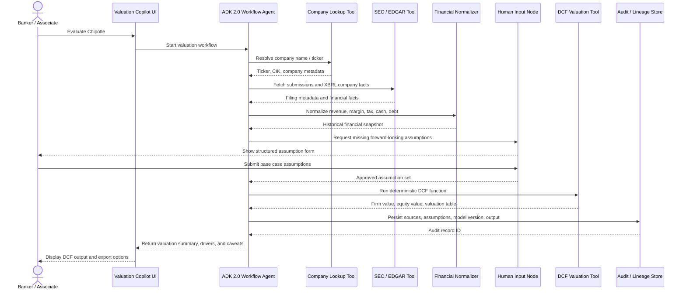

# From DCF Notebook to M&A Valuation Agent: Wrapping a Python Valuation Model with Google ADK 2.0

*Building a governed agentic valuation workflow for technical teams serving Investment Banking and M&A*

---

Investment banking teams live with a persistent contradiction.

Valuation work is highly structured. Analysts build DCFs, trading comps, transaction comps, sensitivity tables, football fields, and board materials using well-understood methods refined over decades.

And yet the process is still painfully manual.

When a banker asks *"Can we run a base case DCF for this target?"*, that simple question triggers a long chain of work: identify the company, pull the latest filings, normalize historical financials, spread the income statement, decide which inputs are factual and which require banker judgment, run the model, build sensitivities, explain the drivers, and document every assumption for review.

The notebook I started with — Farbod Baharkoush's excellent [DCF Valuation in Python series](https://www.youtube.com/playlist?list=PLHSKzVSgP0i1ZwkyrZBQdtC_g6kYVWoe6) — already solved one important piece of this: a clean, deterministic multi-phase DCF engine in Python.

The next step is **not** to ask an LLM to "do valuation."

The better design is to let the LLM orchestrate the workflow while deterministic tools handle the math, data retrieval, validation, and audit trail. This article walks through how to take that Python DCF notebook and wrap it as an agent using Google ADK 2.0, with SEC/EDGAR integration and human-in-the-loop assumption collection.

The target audience is technical teams supporting Investment Banking and M&A platforms: solution architects, data engineers, AI engineers, valuation technology teams, model risk teams, and deal-tech product owners.

The goal is not to replace analysts. It is to make the valuation workflow repeatable, explainable, and easier to govern.

---

## Why this matters in an M&A environment

In M&A, a DCF is not just a calculation. It is a work product.

Valuations appear in pitch books, fairness opinion support, board presentations, buy-side screening, sell-side positioning, strategic alternatives reviews, synergy cases, take-private analyses, carve-out models, and negotiation support. For technical teams, that means the system must clear a materially different bar than a casual AI demo.

| Requirement | Why it matters in M&A |
|---|---|
| **Repeatability** | The same assumptions must produce the same result every time |
| **Traceability** | Every value must tie back to a source, assumption, or transformation |
| **Human judgment** | Growth, margin, WACC, and terminal value assumptions must be owned by bankers, not generated by an LLM |
| **Entitlement control** | Public data, licensed data, confidential data room content, and MNPI must be separated |
| **Reviewability** | MDs, valuation committees, legal, compliance, and model governance teams need a clear audit trail |
| **Explainability** | The output must explain what changed, why it changed, and which assumptions drive value |

This is the core reason to separate agent orchestration from valuation computation. The LLM should not be the valuation model. **The LLM should be the workflow coordinator.**

---

## The starting point: a multi-phase Python DCF notebook

Farbod Baharkoush's five-session DCF series builds a complete multi-phase valuation engine in Python. The notebook contains helper functions for convergence and projections, revenue and operating margin logic, cost of capital and reinvestment logic, and a Chipotle worked example that runs end-to-end. It also includes a Monte Carlo simulation wrapper and Plotly charting utilities.

The core function is:

```python
valuator_multi_phase(...)
```

It accepts assumptions including risk-free rate, equity risk premium, unlevered beta, cost of debt, effective and marginal tax rates, multi-phase revenue growth, operating margin trajectory, sales-to-capital ratio, cash, debt, and current invested capital.

It returns a structured result:

```python
{
    "valuation": df_valuation,
    "firm_value": firm_value,
    "equity_value": intrinsic_equity_present_value,
    "cash_and_non_operating_asset": cash_and_non_operating_asset,
    "debt_value": debt_value,
    "value_of_operating_assets": value_of_operating_assets
}
```

For a research notebook, that is entirely sufficient.

For an enterprise agent, it is not. An agent needs typed inputs, validation, missing-input detection, structured JSON output, source attribution, assumption lineage, exception handling, and workflow control. The first engineering task is therefore to turn the notebook function into a proper tool.

---

## The key design principle

The central principle is simple:

> **Use deterministic code for valuation math. Use the agent for orchestration, data gathering, questioning, and explanation.**

A DCF has two very different categories of inputs, and treating them the same is where most demos go wrong.

**Historical facts** — revenue, operating income, tax expense, cash, debt, shares outstanding, filing dates — can be retrieved and normalized from public filings. These values have a source, a date, and a clear chain of custody.

**Forward-looking assumptions** — future revenue growth, target operating margin, terminal growth, beta, equity risk premium, synergy capture, integration costs, control premium — require human judgment. They reflect a deal narrative: the management case, the banker's base case, the sponsor's downside, the strategic buyer's synergy view.

A good M&A valuation agent must know the difference. It should retrieve the first category and ask for the second. Figure 1 shows what that separation looks like in practice: the LLM owns the top of the flow, the deterministic Python engine sits at the bottom, and the two are connected by a controlled handoff through human assumption capture.




---

## Architecture overview

The agent coordinates a controlled pipeline rather than independently valuing the company. Figure 2 shows the full target architecture, from the banker's request through to the final output and governance layer.

%%{ Figure 2: Target architecture for an M&A valuation agent }%%



Each node has a clear responsibility. The LLM understands context, asks the right questions, and calls the right tools in sequence. The Python DCF engine handles the arithmetic. The governance layer — audit log, source lineage, entitlements, and model risk controls — captures everything in parallel. Notice that the DCF tool is downstream of both the normalized financial snapshot and the approved assumption set: neither feeds the model alone.

---

## Where Google ADK fits

Google ADK lets developers define agents with tools built from custom Python functions. A Python function added to an agent's `tools` list is automatically wrapped as a `FunctionTool` — the framework inspects the function signature, docstring, type hints, and defaults to generate the schema the model uses to call it.

That is exactly the right pattern for a DCF function. ADK 2.0 also supports graph workflows that can pause and request human input through `RequestInput`, which is valuable here because some assumptions must be explicitly provided or approved by a banker, not inferred.

One important caveat: ADK 2.0 is currently marked Beta, and Google notes it may introduce breaking changes. For production deployments at a bank, treat it as an evaluation candidate and route it through your normal platform engineering, model risk, security, and change management processes.

---

## Step 1: Wrap the DCF function as a tool

The notebook function should not be exposed to the agent directly. Instead, create a wrapper that validates inputs, checks for missing fields, catches obvious inconsistencies, calls `valuator_multi_phase()`, and returns a JSON-friendly result.

```python
# valuation/dcf_tool.py

from typing import Any, Dict
from valuation.dcf_model import valuator_multi_phase

REQUIRED_DCF_KEYS = [
    "risk_free_rate", "ERP", "equity_value", "debt_value",
    "unlevered_beta", "terminal_unlevered_beta",
    "year_beta_begins_to_converge_to_terminal_beta",
    "current_pretax_cost_of_debt", "terminal_pretax_cost_of_debt",
    "year_cost_of_debt_begins_to_converge_to_terminal_cost_of_debt",
    "current_effective_tax_rate", "marginal_tax_rate",
    "year_effective_tax_rate_begin_to_converge_marginal_tax_rate",
    "revenue_base",
    "revenue_growth_rate_cycle1_begin", "revenue_growth_rate_cycle1_end",
    "revenue_growth_rate_cycle2_begin", "revenue_growth_rate_cycle2_end",
    "revenue_growth_rate_cycle3_begin", "revenue_growth_rate_cycle3_end",
    "revenue_convergance_periods_cycle1",
    "revenue_convergance_periods_cycle2",
    "revenue_convergance_periods_cycle3",
    "length_of_cylcle1", "length_of_cylcle2", "length_of_cylcle3",
    "current_sales_to_capital_ratio", "terminal_sales_to_capital_ratio",
    "year_sales_to_capital_begins_to_converge_to_terminal_sales_to_capital",
    "current_operating_margin", "terminal_operating_margin",
    "year_operating_margin_begins_to_converge_to_terminal_operating_margin",
]


def run_dcf_valuation(params: Dict[str, Any]) -> Dict[str, Any]:
    """
    Runs a multi-phase discounted cash flow valuation.

    Args:
        params: Dictionary of DCF assumptions. Percentage values should be
                expressed as decimals (e.g. 4% = 0.04).

    Returns:
        A JSON-friendly dictionary containing firm value, intrinsic equity
        value, operating asset value, debt, cash, and the projected
        valuation table.

    Governance:
        Call only after historical facts and forward-looking assumptions
        have been collected, validated, and logged.
    """
    missing = [key for key in REQUIRED_DCF_KEYS if key not in params]
    if missing:
        return {
            "status": "missing_inputs",
            "missing_inputs": missing,
            "message": "DCF cannot run until all required inputs are provided.",
        }

    terminal_growth = params["revenue_growth_rate_cycle3_end"]
    risk_free_rate = params["risk_free_rate"]

    if terminal_growth > risk_free_rate:
        return {
            "status": "invalid_inputs",
            "message": (
                "Terminal growth exceeds the risk-free rate. "
                "Please revise or explicitly approve this assumption."
            ),
            "terminal_growth_rate": terminal_growth,
            "risk_free_rate": risk_free_rate,
        }

    result = valuator_multi_phase(**params)
    valuation_table = result["valuation"].reset_index().to_dict(orient="records")

    return {
        "status": "success",
        "firm_value": float(result["firm_value"]),
        "intrinsic_equity_value": float(result["equity_value"]),
        "value_of_operating_assets": float(result["value_of_operating_assets"]),
        "cash_and_non_operating_asset": float(result["cash_and_non_operating_asset"]),
        "debt_value": float(result["debt_value"]),
        "valuation_table": valuation_table,
    }
```

This wrapper turns a research function into a controlled tool. In ADK, the agent is wired up as:

```python
from google.adk.agents import Agent
from valuation.dcf_tool import run_dcf_valuation

dcf_agent = Agent(
    name="dcf_valuation_agent",
    model="gemini-2.0-flash",
    instruction="""
You are a valuation workflow assistant for M&A teams.

Do not invent forward-looking assumptions.
If required DCF assumptions are missing, ask the user.
Only call run_dcf_valuation when the assumption set is complete.
Always separate SEC-derived facts, market data, and user-provided assumptions.
""",
    tools=[run_dcf_valuation],
)
```

For a bank-grade workflow, this simple `Agent` pattern would be extended into an explicit ADK 2.0 graph workflow — discussed in Step 5.

---

## Step 2: Build SEC/EDGAR tools

The SEC provides JSON-based APIs through `data.sec.gov` for company submissions and XBRL financial statement data. These APIs require no authentication or API keys and cover forms including 10-K, 10-Q, 8-K, 20-F, and 40-F.

Useful endpoints:

```
https://www.sec.gov/files/company_tickers.json
https://data.sec.gov/submissions/CIK##########.json
https://data.sec.gov/api/xbrl/companyfacts/CIK##########.json
https://data.sec.gov/api/xbrl/companyconcept/CIK##########/us-gaap/<TAG>.json
```

```python
# data/sec_tools.py

from typing import Any, Dict
import requests

SEC_HEADERS = {
    "User-Agent": "Your Firm Name valuation-platform@example.com",
    "Accept-Encoding": "gzip, deflate",
}


def _sec_get_json(url: str) -> Dict[str, Any]:
    response = requests.get(url, headers=SEC_HEADERS, timeout=30)
    response.raise_for_status()
    return response.json()


def _format_cik(cik: int | str) -> str:
    return f"CIK{int(cik):010d}"


def lookup_company(query: str) -> Dict[str, Any]:
    """
    Resolves a ticker or company name to SEC company metadata.

    Args:
        query: Company name or ticker (e.g. "CMG" or "Chipotle").

    Returns:
        Matching SEC company records with ticker, title, and CIK.
    """
    url = "https://www.sec.gov/files/company_tickers.json"
    data = _sec_get_json(url)
    q = query.strip().upper()
    matches = []

    for item in data.values():
        ticker = item["ticker"].upper()
        title = item["title"].upper()
        if q == ticker or q in title:
            matches.append({
                "ticker": item["ticker"],
                "title": item["title"],
                "cik": item["cik_str"],
                "cik_padded": _format_cik(item["cik_str"]),
            })

    if not matches:
        return {"status": "not_found", "query": query,
                "message": "No SEC company match found."}

    return {"status": "success", "query": query,
            "best_match": matches[0], "matches": matches[:10]}


def fetch_company_facts(cik: int | str) -> Dict[str, Any]:
    """Fetches SEC XBRL company facts."""
    cik_padded = _format_cik(cik)
    url = f"https://data.sec.gov/api/xbrl/companyfacts/{cik_padded}.json"
    return _sec_get_json(url)
```

One operational caveat worth noting: the SEC's fair-access guidelines currently limit users to no more than 10 requests per second. Production architecture needs rate limiting, retries with backoff, caching, and request logging built in from the start.

---

## Step 3: Normalize XBRL facts into a DCF starting point

SEC XBRL data is powerful but not a ready-made DCF input sheet. Different companies use different tags for similar concepts. Some are annual; others quarterly. Some are point-in-time; others duration-based. A normalization layer resolves this.

```python
# data/sec_normalizer.py

from typing import Any, Dict, Iterable, Optional


def _latest_annual_usd_fact(
    company_facts: Dict[str, Any],
    tag_candidates: Iterable[str],
) -> Optional[float]:
    us_gaap = company_facts.get("facts", {}).get("us-gaap", {})

    for tag in tag_candidates:
        concept = us_gaap.get(tag)
        if not concept:
            continue

        usd_facts = concept.get("units", {}).get("USD", [])
        annual = [
            item for item in usd_facts
            if item.get("form") == "10-K" and item.get("fp") == "FY"
        ]
        if not annual:
            continue

        annual = sorted(
            annual,
            key=lambda x: (x.get("fy", 0), x.get("filed", "")),
            reverse=True,
        )
        return float(annual[0]["val"])

    return None


def build_financial_snapshot(company_facts: Dict[str, Any]) -> Dict[str, Any]:
    """
    Converts SEC company facts into a compact DCF starting point.

    Extracts historical facts only. Does not generate future assumptions.
    """
    revenue = _latest_annual_usd_fact(
        company_facts,
        ["RevenueFromContractWithCustomerExcludingAssessedTax",
         "Revenues", "SalesRevenueNet"],
    )
    operating_income = _latest_annual_usd_fact(
        company_facts, ["OperatingIncomeLoss"])
    tax_expense = _latest_annual_usd_fact(
        company_facts, ["IncomeTaxExpenseBenefit"])
    pretax_income = _latest_annual_usd_fact(
        company_facts,
        ["IncomeLossFromContinuingOperationsBeforeIncomeTaxesExtraordinaryItemsNoncontrollingInterest",
         "IncomeLossFromContinuingOperationsBeforeIncomeTaxes"],
    )
    cash = _latest_annual_usd_fact(
        company_facts,
        ["CashAndCashEquivalentsAtCarryingValue",
         "CashCashEquivalentsRestrictedCashAndRestrictedCashEquivalents"],
    )
    debt = _latest_annual_usd_fact(
        company_facts,
        ["LongTermDebtAndFinanceLeaseObligations",
         "LongTermDebtNoncurrent", "LongTermDebt"],
    )

    operating_margin = (
        operating_income / revenue
        if revenue and operating_income is not None else None
    )
    effective_tax_rate = (
        tax_expense / pretax_income
        if pretax_income and pretax_income > 0 and tax_expense is not None else None
    )

    return {
        "status": "success",
        "revenue_base": revenue,
        "operating_income": operating_income,
        "current_operating_margin": operating_margin,
        "current_effective_tax_rate": effective_tax_rate,
        "cash_and_non_operating_asset": cash,
        "debt_value_book": debt,
        "notes": [
            "These are historical starting points from public filings.",
            "Future growth, target margin, WACC, reinvestment, and terminal "
            "assumptions require human judgment.",
        ],
    }
```

This function is intentionally conservative. It extracts what is knowable from public filings and stops there. Everything forward-looking is left for the next step.

---

## Step 4: Ask the human for forward-looking assumptions

This is where human-in-the-loop design matters most.

An agent can retrieve historical revenue from a 10-K. It should not silently decide that a company will grow at 12% for five years. In M&A, forward-looking assumptions are part of the deal narrative. They may reflect the management case, the banker's base case, the sponsor's downside, the strategic buyer's synergy view, or street consensus. Each has a different owner and a different governance implication.

The agent should surface what it has, flag what it needs, and ask the banker to supply the rest. Figure 3 shows the decision logic: when the historical snapshot is in place, the agent checks whether all required DCF inputs are present. If not, it generates an assumption request, validates the response, and loops back if anything is implausible or out of range.



```python
from pydantic import BaseModel
from google.adk.events import RequestInput


class DCFUserAssumptions(BaseModel):
    risk_free_rate: float
    ERP: float
    unlevered_beta: float
    terminal_unlevered_beta: float
    current_pretax_cost_of_debt: float
    terminal_pretax_cost_of_debt: float
    marginal_tax_rate: float
    revenue_growth_rate_cycle1_begin: float
    revenue_growth_rate_cycle1_end: float
    length_of_cylcle1: int
    revenue_growth_rate_cycle2_begin: float
    revenue_growth_rate_cycle2_end: float
    length_of_cylcle2: int
    revenue_growth_rate_cycle3_begin: float
    revenue_growth_rate_cycle3_end: float
    length_of_cylcle3: int
    current_sales_to_capital_ratio: float
    terminal_sales_to_capital_ratio: float
    terminal_operating_margin: float
    additional_return_on_cost_of_capital_in_perpetuity: float


def request_dcf_assumptions(snapshot: dict):
    message = f"""
I found the following historical starting point from SEC filings:

Company: {snapshot.get("company_name")}
Ticker: {snapshot.get("ticker")}
Revenue base: {snapshot.get("revenue_base")}
Current operating margin: {snapshot.get("current_operating_margin")}
Current effective tax rate: {snapshot.get("current_effective_tax_rate")}
Cash: {snapshot.get("cash_and_non_operating_asset")}
Book debt: {snapshot.get("debt_value_book")}

I still need forward-looking assumptions to run the DCF:

- Risk-free rate and equity risk premium
- Unlevered beta (current and terminal)
- Pre-tax cost of debt (current and terminal)
- Marginal tax rate
- Three-phase revenue growth (start rate, end rate, years per phase)
- Sales-to-capital ratio (current and terminal)
- Terminal operating margin
- Long-run excess return on capital, if any

Use decimals — e.g. 4% as 0.04.
"""
    yield RequestInput(
        message=message,
        payload=snapshot,
        response_schema=DCFUserAssumptions,
    )
```

In production, this free-text interaction should be replaced with a structured UI: numeric input fields, dropdown scenario labels, validation ranges, approval workflow, assumption comments, and lineage tags. The goal is not just to collect the numbers, but to record who provided them and in what context.

| Input | Source | Owner | Required control |
|---|---|---|---|
| Historical revenue | SEC / data room | System | Source reference |
| Current operating margin | SEC / normalized | System | Data quality flag |
| Forecast growth | Banker / management case | Human | Required approval |
| Terminal growth | Banker / valuation policy | Human | Range validation |
| WACC | Market data + assumption | Human/system | Methodology disclosure |
| Synergies | Deal team | Human | Scenario label |
| Control premium | Banker | Human | Separate from standalone DCF |

---

## Step 5: Define the workflow graph

For M&A, an explicit workflow graph is preferable to a purely autonomous agent. Valuation is sequential. The system should not jump ahead. Figure 4 shows the state machine: each stage gates the next, and the human assumption review has an explicit loop back for cases where inputs are missing or need revision before the DCF tool is called.



The pipeline maps directly to the code nodes below:

A simplified ADK 2.0 graph implementation:

```python
from google.adk import Workflow
from data.sec_tools import lookup_company, fetch_company_facts
from data.sec_normalizer import build_financial_snapshot
from valuation.dcf_tool import run_dcf_valuation


def resolve_company_node(user_request: dict) -> dict:
    result = lookup_company(user_request["company"])
    return result["best_match"]


def fetch_company_facts_node(company: dict) -> dict:
    facts = fetch_company_facts(company["cik"])
    return {"company": company, "company_facts": facts}


def normalize_financials_node(node_input: dict) -> dict:
    snapshot = build_financial_snapshot(node_input["company_facts"])
    snapshot["company_name"] = node_input["company"]["title"]
    snapshot["ticker"] = node_input["company"]["ticker"]
    snapshot["cik"] = node_input["company"]["cik"]
    return snapshot


def merge_inputs_node(node_input: dict) -> dict:
    snapshot = node_input["snapshot"]
    assumptions = node_input["assumptions"]

    params = {}
    # Historical facts from SEC
    params["revenue_base"] = snapshot["revenue_base"]
    params["current_operating_margin"] = snapshot["current_operating_margin"]
    params["current_effective_tax_rate"] = snapshot["current_effective_tax_rate"]
    params["cash_and_non_operating_asset"] = snapshot["cash_and_non_operating_asset"]
    params["debt_value"] = snapshot["debt_value_book"]

    # Human-provided assumptions
    params.update(assumptions)

    # Convergence defaults
    params["year_beta_begins_to_converge_to_terminal_beta"] = 1
    params["year_cost_of_debt_begins_to_converge_to_terminal_cost_of_debt"] = 3
    params["year_effective_tax_rate_begin_to_converge_marginal_tax_rate"] = 1
    params["revenue_convergance_periods_cycle1"] = 1
    params["revenue_convergance_periods_cycle2"] = 1
    params["revenue_convergance_periods_cycle3"] = 1
    params["year_sales_to_capital_begins_to_converge_to_terminal_sales_to_capital"] = 1
    params["year_operating_margin_begins_to_converge_to_terminal_operating_margin"] = 1

    return params


root_agent = Workflow(
    name="mna_dcf_valuation_workflow",
    edges=[
        (
            "START",
            resolve_company_node,
            fetch_company_facts_node,
            normalize_financials_node,
            request_dcf_assumptions,
            merge_inputs_node,
            run_dcf_valuation,
        )
    ],
)
```

A real banking workflow would add entitlement checks before retrieval, source classification, data room permission validation, input approval routing, model version pinning, output retention policy, and compliance logging.

---

## What the interaction looks like

Figure 5 maps the full message flow between the banker, the UI, the agent, and each tool. It shows two things that are easy to miss in a simple demo: first, that the human input node is a genuine pause in execution, not a prompt injection; second, that sources and assumptions are persisted to an audit store as a separate step before the result is returned to the banker.



The conversation itself looks like this:

> **Banker:** Evaluate Chipotle.
>
> **Agent:** I found Chipotle Mexican Grill, Inc. (CMG). Here is the historical starting point from the most recent 10-K:
>
> Revenue base: $X.Xbn | Operating margin: XX% | Effective tax rate: XX% | Cash: $XXXm | Book debt: $XXXm
>
> Before I can run the DCF, I need your forward-looking assumptions. Please provide revenue growth for each of the three phases, the length of each phase, your terminal operating margin, risk-free rate, equity risk premium, unlevered beta (current and terminal), sales-to-capital ratio (current and terminal), and marginal tax rate.
>
> **Banker:** Base case: risk-free 4.0%, ERP 4.8%, unlevered beta 0.90 converging to 1.00, phase 1 growth 12% → 10% over 5 years, phase 2 9% → 6% over 5 years, phase 3 5% → 3% over 5 years, terminal margin 18%, sales-to-capital 1.7x now 1.3x terminal, marginal tax 25%, no excess return in perpetuity.
>
> **Agent:** Running the DCF on your base case assumptions...
>
> **Intrinsic equity value:** $Xbn | **Firm value:** $Xbn | **Value of operating assets:** $Xbn
>
> The largest value drivers are terminal operating margin, mature-phase growth, sales-to-capital ratio, and cost of capital. I've logged the SEC sources, your base case assumptions, and the model output for review.
>
> *This is a model result, not investment advice. All forward-looking assumptions were provided by the user.*

For M&A teams, the next step would be to export into Excel, PowerPoint, a valuation committee memo, or a deal workspace system.

---

## Adding Monte Carlo simulation

The original notebook includes a Monte Carlo wrapper, and earlier work in this space — including [StochyAI's exploration of MC simulation in DCF contexts](https://medium.com/@igor_stochy/integrating-monte-carlo-simulation-into-dcf-modeling-131784fa7db) — demonstrates the basic mechanics well.

The enterprise version goes further. Investment banking teams rarely care about a single-point estimate. They care about ranges, and they want those ranges to reflect real business uncertainty, not arbitrary random noise.

In an M&A context, the right approach is to let the banker specify distributions — not the agent invent them:

| Variable | Base case | Distribution |
|---|---|---|
| Terminal margin | 18.0% | Normal, mean 18%, σ 1.5% |
| Terminal growth | 3.0% | Triangular, low 2%, mode 3%, high 4% |
| Sales-to-capital | 1.3x | Normal, mean 1.3x, σ 0.2x |
| ERP | 4.8% | Fixed or scenario-based |
| Revenue CAGR | 8.0% | Scenario distribution |

The Monte Carlo agent then produces a valuation percentile range, probability of exceeding the current market price, downside/base/upside cases, key value driver sensitivities, and distribution charts.

The control requirement is the same as for the base case: the user approves the distributions. The model does not invent them.

---

## Production controls for banking environments

Before any of this goes into a production environment, technical teams should treat it as a controlled workflow, not a productivity feature.

**Entitlement and data classification.** The agent must know whether it is working with public data, licensed market data, internal research, confidential client data, data room content, or MNPI. Different data classes require different permissions, storage rules, and output restrictions.

**Source lineage.** Every historical number should carry structured metadata:

```json
{
  "value": 123456789,
  "metric": "Revenue",
  "source": "SEC XBRL",
  "form": "10-K",
  "filing_date": "YYYY-MM-DD",
  "accession_number": "...",
  "xbrl_tag": "RevenueFromContractWithCustomerExcludingAssessedTax"
}
```

**Assumption ownership.** Every forward-looking input should carry:

```json
{
  "assumption": "terminal_operating_margin",
  "value": 0.18,
  "scenario": "base_case",
  "provided_by": "analyst@example.com",
  "approved_by": "vp@example.com",
  "timestamp": "2026-05-11T10:30:00Z",
  "comment": "Based on management case and peer margin benchmarking."
}
```

**Model versioning.** Output should record the DCF model version, Python package version, notebook lineage, valuation date, scenario name, run ID, and input hash. This is what makes old valuations reproducible during review.

**Guardrails.** The agent should refuse or escalate when required assumptions are missing, terminal growth exceeds a policy threshold, source data is stale, filings cannot be reconciled, the user lacks entitlement, or confidential data would be exposed.

---

## Recommended agent instruction

The system instruction shapes behavior more than almost anything else:

```
You are an M&A valuation workflow assistant.

Your job is to coordinate valuation workflows, not to independently make
investment recommendations.

Always separate:
1. Historical facts from filings or approved data sources
2. Market data from approved providers
3. User-provided assumptions
4. Model-generated outputs

Never invent forward-looking assumptions. If you create an illustrative
scenario, label it clearly as illustrative and not banker-approved.

Before calling the DCF valuation tool:
- confirm all required inputs are present
- validate percentage values are expressed as decimals
- check terminal growth against policy limits
- confirm the scenario name and valuation date
- capture assumption provenance

After running the model:
- explain the key assumptions and largest value drivers
- disclose data sources
- state limitations clearly
- do not provide buy/sell/hold recommendations
```

---

## Extending to a full M&A valuation workbench

Once the DCF agent works, the same pattern extends naturally to a broader platform. Figure 6 shows how the same financial snapshot that feeds the DCF can simultaneously feed a trading comps agent, a transaction comps agent, an LBO screener, and a synergy model — all converging into a single valuation range that populates a football field and, ultimately, pitch book or board materials.

```mermaid
graph TD;
flowchart LR
    A[Target Company] --> B[Financial Snapshot]
    B --> C[DCF Agent]
    B --> D[Trading Comps Agent]
    B --> E[Transaction Comps Agent]
    B --> F[LBO Screening Agent]
    B --> G[Synergy Case Agent]

    C --> H[Valuation Range]
    D --> H
    E --> H
    F --> H
    G --> H

    H --> I[Football Field]
    I --> J[Pitch Book / Board Materials]
```

The same source lineage, entitlement controls, and human-in-the-loop assumption pattern supports DCF, public comps, precedent transactions, accretion/dilution, LBO screening, sum-of-the-parts, synergy modeling, and fairness opinion support. The DCF tool is just the first node in a much larger workbench.

---

## What not to automate

Some parts of M&A valuation should remain human-led regardless of what the technology can do:

- Final valuation conclusions
- Fairness opinion judgments
- Board recommendation language
- Synergy credibility assessments
- Buyer intent
- Negotiation strategy
- Legal and compliance sign-off

Agents accelerate analysis. They should not own judgment.

The right model is: **machine prepares, human decides, system records.**

---

## Conclusion

The most important lesson from turning a DCF notebook into an agent is a design constraint, not a technology choice:

**The LLM should not be the valuation model.**

The valuation model should be deterministic, tested, and versioned. The LLM should orchestrate company lookup, filing retrieval, financial normalization, assumption collection, validation, tool execution, explanation, and audit logging.

A demo that asks an LLM to "value this company" is interesting. A governed agentic valuation pipeline is useful.

The future of M&A technology is not replacing deal teams with agents. It is giving them better infrastructure: tools that reduce manual effort, preserve judgment, improve traceability, and make valuation work easier to review.

That is the real opportunity.

---

## References and further reading

- Farbod Baharkoush, *How to Value Any Stock: Discounted Cash Flow Valuation in Python* — 5-part YouTube series, the source of the notebook used in this article: [YouTube playlist](https://www.youtube.com/playlist?list=PLHSKzVSgP0i1ZwkyrZBQdtC_g6kYVWoe6)
- StochyAI, *Integrating Monte Carlo Simulation into DCF Modeling*, Medium (2022) — an approachable introduction to the MC/DCF concept: [Medium article](https://medium.com/@igor_stochy/integrating-monte-carlo-simulation-into-dcf-modeling-131784fa7db)
- Google ADK Function Tools documentation: custom Python functions as agent tools, schema generation from type hints and docstrings
- Google ADK 2.0 Human Input documentation: graph workflows, `RequestInput`, Beta status notice
- SEC EDGAR API documentation: `data.sec.gov` JSON APIs for submissions and XBRL company facts, no authentication required
- SEC Developer Resources: fair-access guidance, 10 requests/second limit
- Google Cloud ADK overview: orchestration, multi-agent architectures, enterprise deployment patterns

---

*All code examples are illustrative. Production deployments in regulated environments require appropriate model risk management, compliance review, legal sign-off, and technology governance.*
