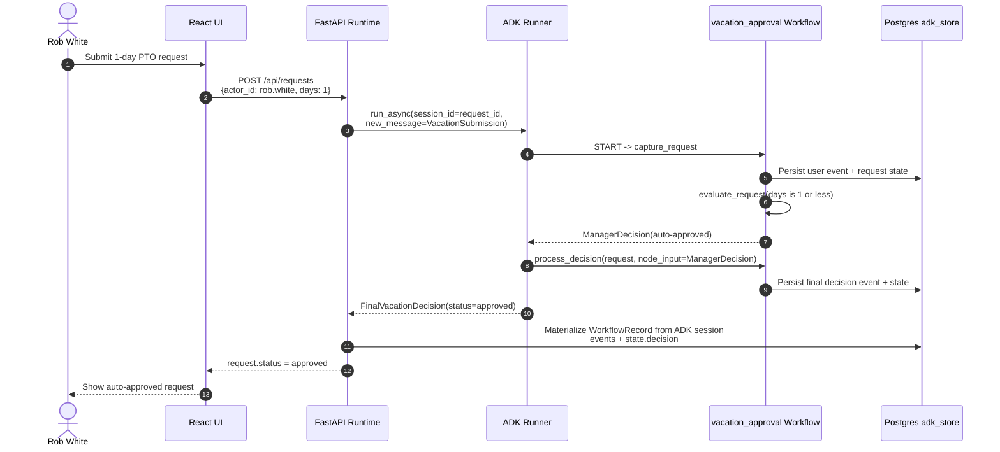
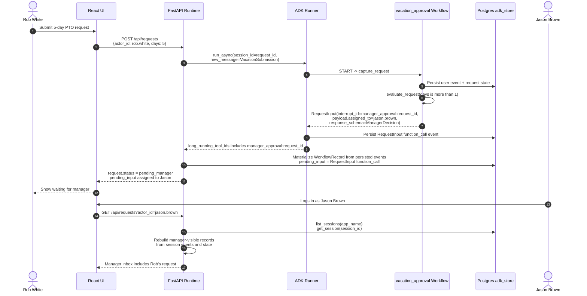
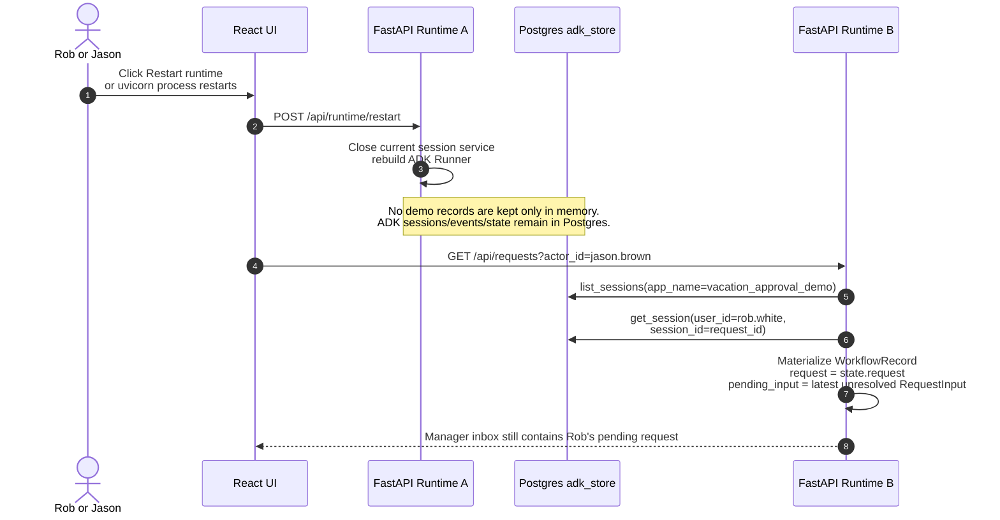
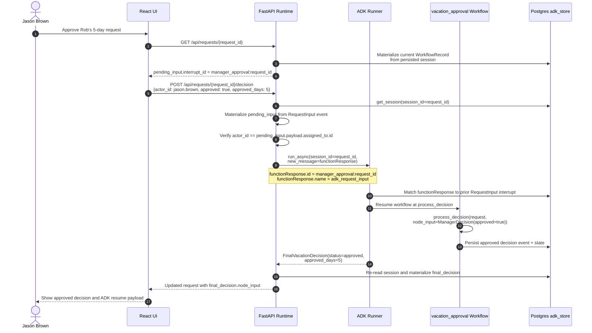
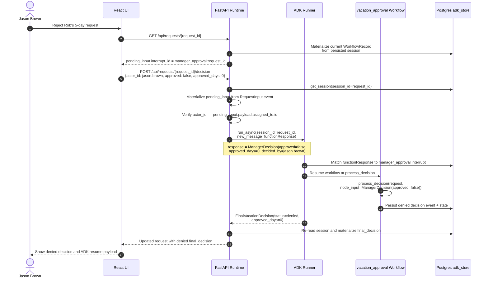

# Building Human-in-the-Loop AI Workflows That Survive Real Life

## A practical Google ADK 2.0 Beta walkthrough with vacation approvals, manager review, workflow pause/resume, and Postgres-backed persistence

> Publishing note: Medium does not reliably render Mermaid diagrams natively. Export the Mermaid diagrams in this draft to PNG/SVG before publishing, or replace each Mermaid block with the rendered image and keep the caption.

## The Problem

Most AI demos assume the world is synchronous.

The user asks a question. The agent thinks. The agent answers. Done.

But real business processes are rarely that clean.

Imagine Rob White wants to take time off. If Rob requests one day, the company policy can approve it automatically. If Rob requests five days, his manager, Jason Brown, needs to review it.

That sounds simple until you ask the practical questions:

- What happens when Rob submits the request and Jason is not online?
- Where does the workflow wait?
- How does Jason see the pending approval?
- How does Jason's approval resume the exact workflow that Rob started?
- What if the backend restarts while the workflow is waiting?
- How do we prevent Rob from approving his own request?

This is where Human-in-the-Loop, or HITL, stops being a buzzword and becomes an application architecture problem.

Google's Agent Development Kit, or ADK, gives us the building blocks for this. In ADK 2.0 Beta, graph-based workflows can explicitly request human input using `RequestInput`. The official ADK docs describe three important options on `RequestInput`: `message`, `payload`, and `response_schema` [1]. Those three options are the foundation of the workflow in this article.

Ali Arsanjani's Medium article on long-running HITL workflows frames the broader challenge well: long-running workflows need to pause, persist, and resume later when a person responds [2]. This article turns that idea into a concrete, front-to-back example.

We will build the vacation approval flow slowly:

1. Rob White requests one day off.
2. Rob White requests five days off.
3. Jason Brown approves.
4. Jason Brown rejects.
5. The backend restarts while the request is pending, and the workflow still survives.

The example uses:

- Google ADK 2.0 Beta workflows
- `RequestInput`
- Pydantic schemas
- React for the UI
- FastAPI for the app runtime
- Postgres for ADK session persistence

## The Business Story

Our vacation policy has one rule:

> Requests for one day or less are auto-approved. Requests for more than one day require manager approval.

We have two people:

- Rob White, employee
- Jason Brown, manager

The important part is not the vacation policy. The important part is the control flow.

For a one-day request, the workflow can complete immediately.

For a five-day request, the workflow must pause, hand a structured task to Jason, and later resume with Jason's decision.

That is the essence of HITL:

> The machine handles the routine path. The human handles judgment, exception, and accountability.

## The Workflow Shape

At a high level, the ADK workflow has three nodes:

```text
START -> capture_request -> evaluate_request -> process_decision
```

Each node has a clear responsibility:

- `capture_request` turns Rob's request into a structured vacation request.
- `evaluate_request` decides whether policy can auto-approve or whether Jason must review.
- `process_decision` produces the final approval or denial.

The key branch is in `evaluate_request`.

If the request is one day, `evaluate_request` yields a `ManagerDecision` from the auto-policy path.

If the request is more than one day, `evaluate_request` yields `RequestInput`. That is the pause point.

## The Schemas: Contracts Between Humans, UI, and Workflow

For non-technical readers, a schema is just an agreement about what information must be present.

For technical readers, these are Pydantic models used by ADK to validate and pass structured data between nodes.

The request Rob submits becomes a `VacationSubmission`:

```python
class VacationSubmission(BaseModel):
    request_id: str
    employee_id: str
    start_date: date
    end_date: date
    days: int
    reason: str
```

The workflow enriches that into a `VacationRequest`:

```python
class VacationRequest(BaseModel):
    request_id: str
    employee_id: str
    employee_name: str
    manager_id: str
    manager_name: str
    start_date: date
    end_date: date
    days: int
    reason: str
    requires_manager_approval: bool
```

Jason's decision is represented as `ManagerDecision`:

```python
class ManagerDecision(BaseModel):
    approved: bool
    approved_days: int | None = None
    comment: str | None = None
    decided_by: str | None = None
    decided_by_name: str | None = None
```

That `ManagerDecision` is the most important schema in the article.

It does two jobs:

- It tells the UI what Jason must submit.
- It tells ADK what `process_decision` expects as `node_input`.

This matters because the ADK docs note that a `response_schema` does not magically rewrite arbitrary human input into the right structure [1]. The UI should collect structured data so the response already fits the schema.

## Journey 1: Rob Requests One Day

In this path, there is no human approval step. The workflow still uses the same final decision node, but the decision comes from policy instead of Jason.



The important detail is that `process_decision` still receives a `ManagerDecision`.

For the one-day path, the workflow creates that decision itself:

```python
if request.days <= AUTO_APPROVAL_MAX_DAYS:
    yield ManagerDecision(
        approved=True,
        approved_days=request.days,
        comment="Auto-approved because the request is 1 day or less.",
        decided_by="policy:auto_approval",
        decided_by_name="Auto Approval Policy",
    )
    return
```

This keeps the rest of the workflow consistent. Whether the decision comes from policy or from Jason, the next node sees the same shape.

## Journey 2: Rob Requests Five Days

Now the workflow cannot finish on its own.

Rob's request is valid, but policy says it needs Jason's judgment. This is where `RequestInput` enters.



The pause happens here:

```python
yield RequestInput(
    interrupt_id=f"manager_approval:{request.request_id}",
    message=(
        f"{request.manager_name}, please review "
        f"{request.employee_name}'s {request.days}-day vacation request."
    ),
    payload={
        "request": request.model_dump(mode="json"),
        "assigned_to": {
            "id": request.manager_id,
            "name": request.manager_name,
            "title": request.manager_title,
        },
        "submitted_by": {
            "id": request.employee_id,
            "name": request.employee_name,
            "title": request.employee_title,
        },
        "policy": request.policy,
    },
    response_schema=ManagerDecision,
)
```

Let's translate that into plain English.

`message` is what Jason sees.

`payload` is the context Jason needs: who requested time off, how many days, dates, reason, policy, and assignment.

`response_schema` is the expected shape of Jason's answer.

`interrupt_id` is the bookmark. It tells ADK, the backend, and the UI which paused workflow this answer belongs to.

The workflow is now paused.

Not failed. Not blocked in a Python thread. Paused.

The pending request is persisted as an ADK event, and the UI can show it in Jason's inbox.

## The Subtle Problem: ADK Web Is Not Your Business App

The original ADK samples are useful, but they are intentionally generic.

When using a developer tool like ADK Web, the same person often submits the original request and then answers the human input prompt. That is fine for debugging, but it is not how the real world works.

In a business app:

- Rob submits the request.
- Jason approves it.
- Rob should not be able to impersonate Jason.
- Jason should see only work assigned to him.

That routing and authorization belongs in the application layer.

In this example, the React/FastAPI app does that work:

```python
if payload.actor_id != record.manager_id:
    raise PermissionError("Only the assigned manager can approve this request.")
```

ADK is responsible for workflow state, events, interruption, and resumption.

The app is responsible for identity, inbox routing, authorization, and UX.

That separation is important.

## Journey 3: Uvicorn Restarts While the Request Is Pending

This is the part that turns the demo from a toy into a realistic POC.

The first version of this example stored `WorkflowRecord` objects in a Python dictionary. That worked until uvicorn restarted. After a restart, the ADK session still existed in Postgres, but the app's in-memory read model was gone.

That is not acceptable for a long-running workflow.

The fix is to treat `WorkflowRecord` as a read model, not as the source of truth.

The source of truth is ADK's session store.



The materializer reads persisted ADK sessions:

```python
response = await self.session_service.list_sessions(app_name=APP_NAME)
for session_ref in response.sessions:
    session = await self.session_service.get_session(
        app_name=APP_NAME,
        user_id=session_ref.user_id,
        session_id=session_ref.id,
    )
```

Then it reconstructs the UI-friendly record:

```python
request = session.state.get("request")
final_decision = session.state.get("decision")

for event_record in events:
    request_input = _extract_request_input(event_record)
    if request_input is not None:
        pending_input = request_input

    resume_payload = _extract_resume_payload(event_record)
    if resume_payload is not None:
        resume_payloads.append(resume_payload)
```

This is a small version of a common production pattern:

> Persist the canonical event stream. Rebuild read models from it.

For this POC, ADK's Postgres-backed sessions are the event stream.

## Journey 4: Jason Approves

When Jason approves, the UI does not start a new workflow.

It answers the paused workflow.

That answer is sent as a FunctionResponse event.



The FunctionResponse looks like this:

```json
{
  "role": "user",
  "parts": [
    {
      "functionResponse": {
        "id": "manager_approval:vac-123",
        "name": "adk_request_input",
        "response": {
          "approved": true,
          "approved_days": 5,
          "comment": "Coverage is arranged.",
          "decided_by": "jason.brown",
          "decided_by_name": "Jason Brown"
        }
      }
    }
  ]
}
```

There are two fields you should not miss:

- `id`
- `name`

The `id` must match the original `RequestInput.interrupt_id`.

The `name` must be `adk_request_input`.

That is how ADK knows this is not a new user message. It is the answer to the pending human input request.

Once ADK sees that FunctionResponse, it resumes the interrupted workflow and passes the `response` body to the next node as `node_input`.

That is the resurrection step.

The workflow is not restarted from `START`. ADK loads the persisted session, matches the FunctionResponse to the earlier `RequestInput` using the interrupt id, and continues from the edge after the paused node. In this example, that means Jason's response is delivered directly to `process_decision`.

In our workflow:

```python
def process_decision(
    ctx: Context,
    request: VacationRequest,
    node_input: ManagerDecision,
) -> Event:
    ...
```

`node_input` is Jason's structured decision.

## Journey 5: Jason Rejects

Rejection is the same mechanism.

Only the `response` changes.



The workflow does not care whether the answer is yes or no. It only cares that the answer conforms to the expected schema.

That is the power of treating human input as structured workflow data instead of an ad hoc chat message.

## Why Persistence Is Not Optional

For a real HITL workflow, persistence is not a nice-to-have.

It is the difference between a workflow and a notification.

If the workflow is waiting for Jason, and the backend restarts, we need to recover:

- The original request
- The pending interrupt
- The manager assignment
- The expected response schema
- The event history
- The final decision, if it happened

The example uses ADK's `DatabaseSessionService` with Postgres:

```python
def build_session_service() -> BaseSessionService:
    db_url = os.getenv("ADK_DEMO_DATABASE_URL") or DEFAULT_DB_URL
    db_schema = os.getenv("ADK_DEMO_DB_SCHEMA", DEFAULT_DB_SCHEMA)

    return DatabaseSessionService(
        db_url=db_url,
        connect_args={
            "server_settings": {
                "search_path": db_schema,
            }
        },
    )
```

The app then materializes the read model every time it needs to show requests:

```python
async def visible_records(self, actor_id: str) -> list[WorkflowRecord]:
    records = await self._materialize_all_records()
    return [
        record
        for record in records
        if record.employee_id == actor_id or record.manager_id == actor_id
    ]
```

This is the practical answer to, "What happens after uvicorn restarts?"

The new process lists ADK sessions from Postgres, loads their events, rebuilds `WorkflowRecord`, and shows Jason the pending approval.

## The Mental Model

Here is the simplest way to understand the whole system:

Rob's request starts a workflow.

The workflow reaches a point where policy says, "A human must decide."

ADK emits `RequestInput`.

The app turns that into a manager inbox item.

Jason approves or rejects.

The app sends a FunctionResponse with the same interrupt id.

ADK resumes the workflow.

`process_decision` receives Jason's answer as `node_input`.

The final decision is persisted.

The UI shows the result.

If the backend restarts in the middle, Postgres still has the workflow state and event history.

## Design Lessons

### 1. HITL is not just a button

A button is only the visible part. The real system needs identity, routing, schema validation, persistence, and resume semantics.

### 2. Human decisions should be structured

Jason should not type "sure." The UI should submit:

```json
{
  "approved": true,
  "approved_days": 5,
  "comment": "Coverage is arranged.",
  "decided_by": "jason.brown"
}
```

That makes the workflow predictable.

### 3. The interrupt id is the bookmark

Without the original `interrupt_id`, ADK cannot know which paused workflow the answer belongs to.

### 4. The app owns authorization

ADK can pause and resume. Your application must decide who is allowed to answer.

### 5. Persistence is part of the product

If a workflow waits for humans, it may wait minutes, hours, or days. The process cannot depend on one Python object staying alive.

## What I Would Add Before Production

This example is intentionally small, but the pattern scales.

Before using this in a real enterprise setting, I would add:

- Real authentication and role mapping
- Email or Slack notification to the manager
- Expiration and escalation rules
- Audit log screens
- Idempotency handling on approval submission
- Concurrency protection if two managers can act on the same item
- Observability around pending interrupts
- Database migrations instead of auto-created tables
- Tests against a real Postgres test container

The core pattern would remain the same.

## Conclusion

Human-in-the-loop workflows are not about slowing AI down.

They are about putting human judgment exactly where it belongs.

In the vacation approval example, ADK handles the workflow graph, pause point, event persistence, and resume mechanics. The application handles identity, inbox routing, authorization, and user experience.

That separation is what makes the design understandable.

Rob starts the workflow.

ADK pauses it.

Jason answers it.

ADK resumes it.

Postgres makes sure the whole thing survives real life.

## References

[1] Google ADK Documentation: Human input for agent workflows  
https://adk.dev/workflows/human-input/

[2] Ali Arsanjani, "Mastering Long-Running AI Workflows: A Guide to Human-in-the-Loop (HITL) with Google's ADK"  
https://dr-arsanjani.medium.com/mastering-long-running-ai-workflows-a-guide-to-human-in-the-loop-hitl-with-googles-adk-5c5df5d88900

[3] Google ADK Python repository  
https://github.com/google/adk-python
